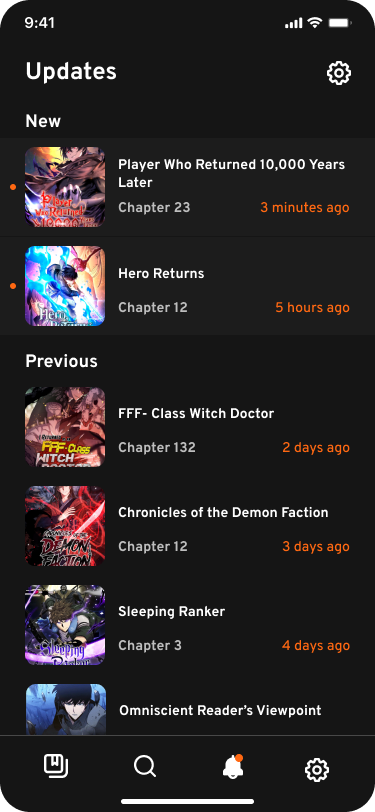

### Manhwa Alert

  
   
  

Still thinking about the name.

I've always had a stroke tracking new chapters from multiple scanlators because I read many webtoons from a lot of them.

This app alerts readers of new chapters of their favorite Manhwas.
Basically, the <a href="https://github.com/e-meyer/manhwa-helper-server">backend</a> just scrape some websites every x minutes to check if a new chapter of a manhwa was released. Then it gets the list of releases from a predetermined set of Scanlators that I like the most like Asura, Luminous, Flame, and Reaper, initially.
After tapping the notification, or a chapter in the details screen, it redirects the user to the scanlator website chapter page to read the chapter, to also help scanlators growth and not just scrape them.

For now it's just something for me because it's a pain to always be opening new tabs to look for new chapters, opening all pages just to find out that no new chapters of manhwas I like were released. So I just want to know when I need to check that out, or just open the app and click the button.

It would probably be a better idea to just be checking the __#releases__ channel on the discord of every scanlator, but I also want to learn some new tools. And there may be some releases that they don't announce there too.

I'm planning to use Firebase Cloud Messaging for notifications for now because I'm used to integrating Flutter and Firebase, but maybe I'll switch to Amazon Amplify later on because I'm more familiar with AWS interface, but haven't tried it yet since it's a new thing. Also studying the cloud hosting part because I don't plan on paying for cloud services, not for now at least.